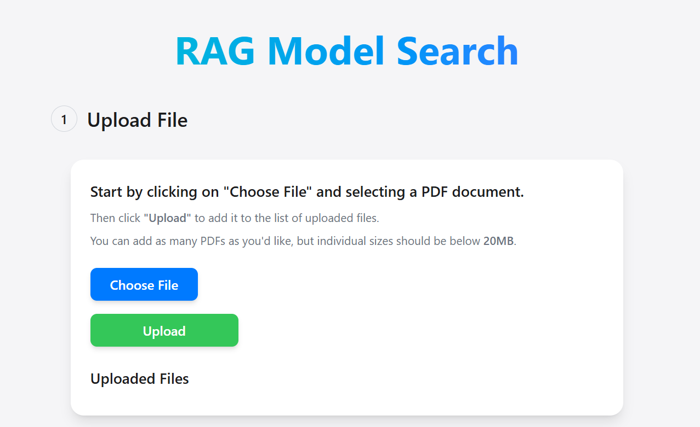
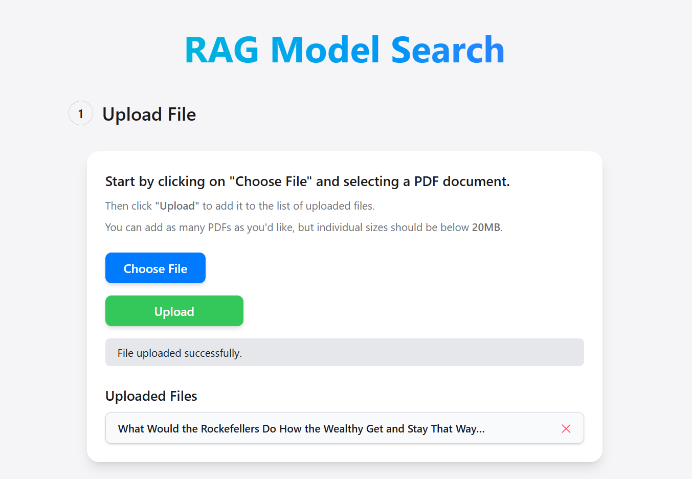
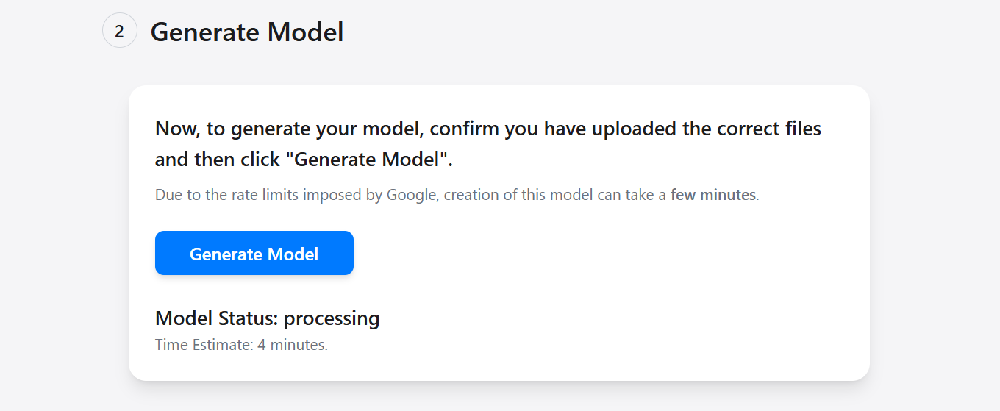
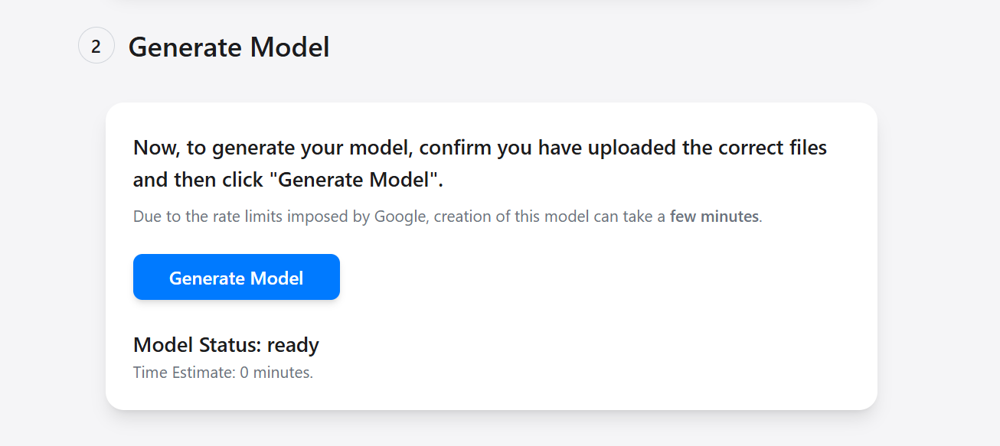
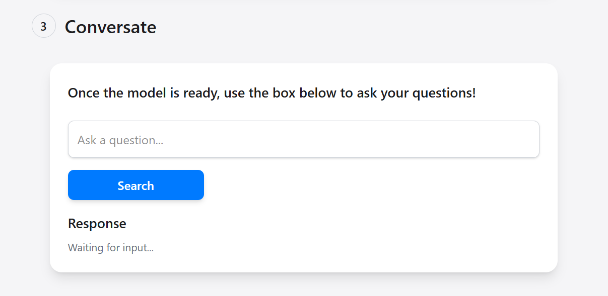
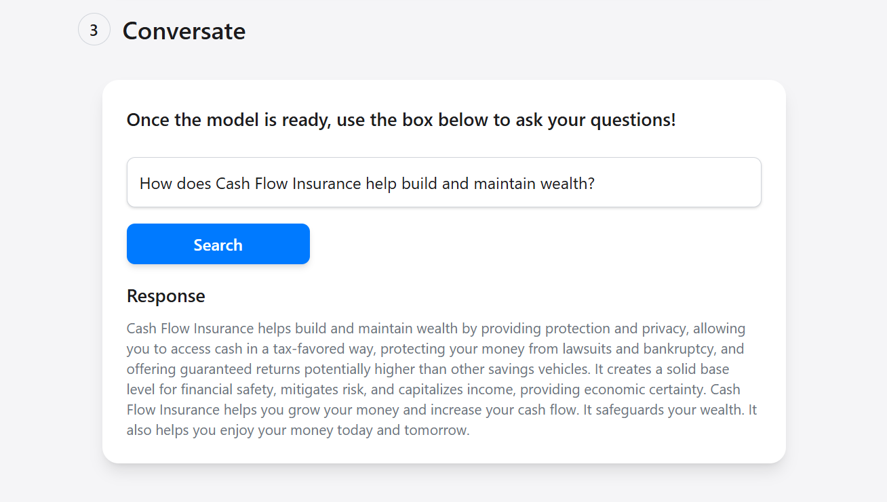

# LLM-Powered Document Query System


## Overview
This project is a Retrieval-Augmented Generation (RAG) model designed to assist users with financial queries using company-provided documents as the source of truth. Initially developed for Videre Financiers, this refactored version includes a **React (Vite) front end** and a **Django backend** with **Google Gemini API** replacing OpenAI's ChatGPT API. The original project files, including my contributions, are included in the folder titled `original-project-files`.

The original model was strictly limited to financial documents provided by Videre Financiers, as they did not allow users to upload custom files. However, in this refactored version, users can upload **any PDF document** and receive AI-powered responses, significantly increasing the model's versatility and applicability beyond financial data.

The system allows users to upload PDFs, process them into a **FAISS vector store**, and use AI-powered search to retrieve relevant information. The chatbot provides accurate, real-time responses, reducing the need for direct human interaction.

## Tech Stack
- **Frontend**: React (Vite), Tailwind CSS
- **Backend**: Django, Django REST Framework
- **Database**: FAISS (for vector storage)
- **AI Model**: Google Gemini API (text-embedding and content generation, previously OpenAI's ChatGPT API)
- **File Processing**: `pymupdf4llm` for PDF parsing

## Features
### 1. **Document Upload & Processing**
- Users can upload **PDF files** via the frontend.
- Backend extracts text and converts it into **vector embeddings**.
- Stores processed data in a **FAISS vector index** for fast retrieval.

### 2. **Model Generation**
- Upon uploading files, users can trigger model generation.
- **Google Gemini API** generates embeddings for each text chunk.
- Data is stored and indexed for efficient search operations.

### 3. **AI-Powered Query System**
- Users submit queries via the frontend.
- The backend retrieves relevant document sections from **FAISS**.
- **Google Gemini API** generates a response using retrieved context.
- The response is displayed in the UI.

### 4. **File Management**
- Users can **upload, view, and delete** files.
- Database tracks document statuses (**Pending, Processed**).
- Unlike the original Videre Financiers model, which was restricted to internal financial documents, this refactored version allows users to upload any PDFs for AI-powered search and retrieval.

## Key Skills Demonstrated
- **Hands-on experience with LLMs**: Built AI-powered search using **Google Gemini API** (previously OpenAI's ChatGPT API).
- **Model development & NLP**: Developed a **retrieval-augmented generation (RAG) model** using **FAISS vector search**.
- **Data preprocessing & structured/unstructured data handling**: Processed and embedded **unstructured PDF documents** for machine learning retrieval.
- **Experience with open-source LLMs & APIs**: Worked with **Gemini API** and previously **ChatGPT API**.
- **Full-stack implementation**: Built an **end-to-end AI-powered application** with a **Django backend and React (Vite) frontend**.
- **Agile methodology & collaboration**: Managed iterative improvements based on feedback, integrating with a broader system.
- **Team Collaboration**: In the original project for Videre Financiers, I worked closely with 4 other developers to integrate my model with the front end.

## Setup & Installation
### 1. Clone the Repository
```sh
git clone https://github.com/YOUR_USERNAME/Videre-Financiers-RAG.git
cd Videre-Financiers-RAG
```

### 2. Backend Setup (Django)
#### Install Dependencies
```sh
cd backend
python -m venv venv
source venv/bin/activate
pip install -r requirements.txt
```
#### Set Up Environment Variables
Create a `.env.local` file in the root directory and add:
```
GOOGLE_API_KEY=your-google-gemini-api-key
```
#### Run Migrations & Start Server
```sh
python manage.py migrate
python manage.py runserver
```

### 3. Frontend Setup (React + Vite)
```sh
cd frontend
npm install
npx vite
```

## Usage
### 1. **Uploading a File**
- Navigate to the application in the browser.
- Click **Choose File**, select a PDF, and upload.


### 2. **Generating the Model**
- Click **Generate Model** after uploading PDFs.
- Wait for model processing to complete.
- **Processing State:**  
  
- **Ready State:**  


### 3. **Asking Questions**
- Enter a question in the input box.
- **Before Input:**  

- The system retrieves the most relevant document chunks.
- AI generates a response using the extracted context.
- **After Querying:**  


## API Endpoints
| Endpoint | Method | Description |
|----------|--------|-------------|
| `/api/file-upload/` | POST | Upload a PDF file |
| `/api/file-list/` | GET | View uploaded files |
| `/api/delete-file/` | POST | Delete a file |
| `/api/generate-model/` | GET | Trigger model processing |
| `/api/check-gen-status/` | GET | Check model generation status |
| `/api/query/` | GET | Query the AI with a question |

## Future Improvements
- Enhance **error handling** in both frontend and backend.
- Implement **streaming responses** for real-time AI output.
- Add **user authentication** for secure document access.
- **Optimize API Call Efficiency**: The Google Gemini API imposes strict rate limits, which required implementing a batching strategy where embedding requests are sent in chunks with a 60-second delay between each batch. Future improvements could explore more efficient asynchronous API calls or alternative APIs with higher rate limits to reduce processing time.
- **Enhance Search Retrieval**: Implement fusion retrieval techniques to combine multiple retrieval strategies for more accurate document matching. Additionally, reranking algorithms (such as cross-encoder reranking or BM25+transformer models) could be used to improve the ranking of search results before passing them to the AI model.

---

